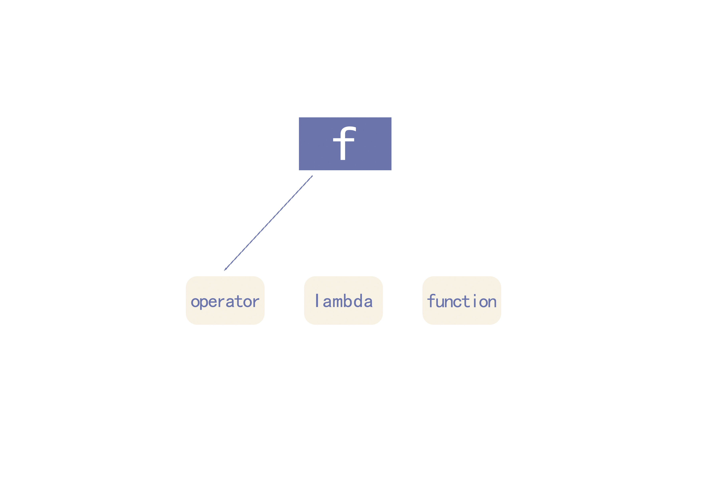

# 一. 认识 function

`std::function` 是C++11引入的类模板包装器，可以用来存储可调用对象
。使用该模板类需要导入`<functional>`头文件。
## 1.1 function的使用
前面提到 `std::function` 可以存储可调用对象，那么什么是可调用对象呢？
简单来说可调用对象是指可以像函数一样被调用的实体，以下给出几个例子。

## 1.2 函数指针
~~~cpp
int (*func_ptr)(int,int);
~~~
## 1.3 重载了（）运算符的类
~~~cpp
struct A {
    void operator()() {
        std::cout << "operator()";
    }
};
~~~
## 1.4 lambda表达式
~~~cpp
auto func = {
    std::cout << "lambda";
};
~~~

现在围绕上述的几个类型展示function的简单使用：
~~~cpp
#include <iostream>
#include <functional>
    
struct A {
    void operator()() {
        std::cout << "operator()\n";
    }
};

void func() {
    std::cout << "function\n";
}

int main() {
    std::function<void(void)> f = A{};
    f(); // 输出 "operator()"
    
    f = []{
        std::cout << "lambda\n";
    };
    f(); // 输出 ”lambda“
    
    f = func;
    f(); // 输出 ”function“
}
~~~

可以观察到，尖括号里面是写的 `void(void)`, 在模板中尖括号里面写的是 类型，这种类似 `void(void)` 的叫做函数类型，代表一个返回 `void`,参数类型
是 `void`的函数，同理如果我有一个函数是`int func(int, int)` 那么所对应的函数类型就是`int(int, int)`。

# 二. 从零开始实现一个简易的function类型

首先对function结构体进行声明：
~~~cpp
template<typename T>
struct function; // 因为函数类型只是一个类型，所以用T

template<typename R,typename...Args>
struct <R(Args...)> function{/***/}; // 用特化来定义
~~~

在上面的使用例子中，同一个变量 `f` 的行为发生了三次变化，类似的行为可以联想到多态
，`function`内部也的确如此，把要调用的多个类型用多个派生类封装起来，然后用一个基类指针去调用派生类的函数。知道了这个原理现在问题成了如何得到这若干个派生类？

虽然都有多个类型，但是我们不管怎么切换类型，最终都是把 `f` 当作函数来调用，而且这些类型的调用方式都是相同的，所以我们可以用通过模板的方式来生成派生类

因为要在function的内部实现多态来存储不同类型的可调用对象，所以我们首先在function内部也创建一个类做为基类，
并且加入关键函数

我们添加以下基类
~~~cpp
// 基类
template<typename R,typename...Args>
struct function<R(Args...)> {
    /*...*/
    struct CallableBase {
        virtual R invoke(Args...args) = 0;
        virtual std::unique_ptr<CallableBase> clone() = 0;
        virtual ~CallableBase() = default;
    };
    std::unique_ptr<CallableBase> callable_;
};
~~~

invoke函数用于执行内部可调用对象，并且将结果返回，创建一个CallableBase指针用于实现多态

现在我们要存储可调用对象存储在不同类型的派生类里，我们利用模板来实现：
~~~cpp
template<typename R,typename...Args>
struct function<R(Args...)> {
    /*...*/
    template<typename F>
    struct Callable : CallableBase {

        template<typename U>
        Callable(U &&other) : callable_func_(std::forward<U>(other)) {}

        R invoke(Args...args) override {
            return callable_func_(std::forward<Args>(args)...);
        }
        std::unique_ptr<CallableBase> clone() override {
            return std::make_unique<Callable>(callable_func_);
        }
            
        F callable_func_;
    };
};
~~~
在派生类中我们存储了具体的可调用对象 `callable_func_` 当function对象被视作函数调用时，invoke函数想要把可调用对象的执行结果返回，所以我们重写
`invoke`函数，将`callalbe_func_`的返回值返回

首先invoke函数就是用来执行函数，将参数传递给invoke函数，然后将callable_的执行结果给返回,这种利用模板来完成存储不同对象的编程技巧叫做
**类型擦除**

现在添加function的构造函数
~~~cpp
template<typename F>
function(F &&f):callable_(std::make_unique<Callable<std::decay_t<F>>>(std::forward<F>(f))) {}
~~~
我们传递一个 F 类型的可调用对象进来，然后由于模板会生成 F 类型所对应的派生类，我们创建一个这样的派生类，并用基类的指针
去指向它。这个时候假设我们创建了一个`function f`,执行`f(arg1，arg2...)`时，只需要返回`callable_`的`invoke`结果即可
，但由于我们期望的结果要通过派生类的invoke得到，如果我们以类似 `f.callable_->invoke(args...)`这样的写法来得到结果显然是不符合
语义的，所以我们需要重载 `()`

添加一个 `operator()`
~~~cpp
R operator()(Args...args) {
    return callable_->invoke(std::forward<Args>(args)...);
}
~~~
思考一个问题，既然构造函数只和 F 有关，那为什么定义 function 的时候需要用函数类型来定义呢，这个主要用于`operator()`
可以看到，`operator（）` 部分用到了声明时的 `R` 和 `Args...`, 这是为了让调用函数的时候与自己存储的可调用对象的调用方法一致

# 三. CTAD

在C++17 以后可以用如下写法
~~~cpp
void foo() {}

int main() {
    std::function f = foo;
}
~~~
我们在声明f的时候并没有显式写出 `void(void)`，这是因为在C++17加入一个新特性 [推导指引(CTAD)](https://zh.cppreference.com/w/cpp/language/class_template_argument_deduction),通过构造时提供的参数来补充需要的类型

我们自己添加一个简单的推导指引来识别普通的函数
~~~cpp
template<typename R, typename ...Args>
function(R(Args...)) -> function<R(Args...)>;
~~~

它的含义是当传递的参数为`R(Args...)`类型时，推导尖括号里面推导为 `<R(Args...)>`

[完整实现](https://github.com/M1saka2003/M1sakalib/blob/master/TinySTL/function.h)
