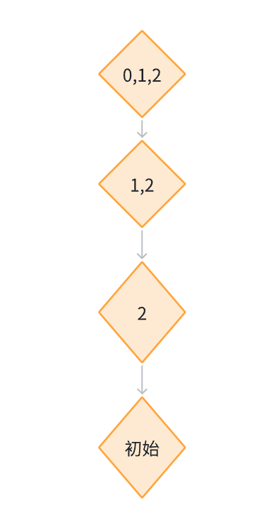

在正式介绍std::index_sequence之前，首先来思考一个问题，如何遍历一个tuple?
# 一. 遍历tuple
## 1.1 关于遍历的一些思考
我们先定义一个简单的tuple
~~~cpp
std::tuple<int,int,int> a{1, 2, 3};
~~~
最原始的方法就是挨着挨着输出
~~~cpp
std::cout << std::get<0>(tuple);
std::cout << std::get<1>(tuple);
std::cout << std::get<2>(tuple);
~~~
或许你会思考，为什么不用循环来实现这样一个操作？我们可以尝试编写如下代码：
~~~cpp
void print_tuple(auto &&tuple) {
    for (int i = 0; i < 3; i++) {
        std::cout << std::get<i>(tuple);
    }
}
~~~
当我们尝试调用这个函数时，发现并没有成功编译，并且给出了以下错误：
~~~
error: the value of 'i' is not usable in a constant expression
    6 |         std::cout << std::get<i>(tuple);
      |                      ~~~~~~~~~~~^~~~~~~
note: 'int i' is not const
    5 |     for (int i = 0; i < 3; i++) {
~~~
这是因为尖括号 `<>`内为[模板非类型形参](https://zh.cppreference.com/w/cpp/language/template_parameters)，传递参数时必须为[常量求值表达式](https://zh.cppreference.com/w/cpp/language/constant_expression#.E5.B8.B8.E9.87.8F.E6.B1.82.E5.80.BC.E7.9A.84.E8.A1.A8.E8.BE.BE.E5.BC.8F)
而循环时的 `i`并非常量，因此想要遍历一个 `tuple`我们就需要得到一个常量序列。
## 1.2 std::integer_sequence
幸运的是从 **C++14** 开始标准库提供了
[std::integer_sequence](https://zh.cppreference.com/w/cpp/utility/integer_sequence) 它表示生成一个编译期整数序列

利用代码举个例子
~~~cpp
std::integer_sequence<std::size_t, 1, 2, 3>{}
// 表示一个 size_t 类型的常量序列[1, 2, 3]
~~~
而在STL中还有个辅助模板
~~~cpp
template<std::size_t... Ints >
using index_sequence = std::integer_sequence<std::size_t, Ints...>;
~~~

## 1.3 遍历tuple的实现
我们利用 `std::index_sequence` 和 **C++17** 引入的[折叠表达式](https://zh.cppreference.com/w/cpp/language/fold)即可利用模板展开
来实现遍历 `tuple`

~~~cpp
#include <iostream>
#include <tuple>

template<std::size_t...index>
void print_tuple(auto &&tuple, std::index_sequence<index...>) {
    (std::cout << ... << std::get<index>(tuple));
}

int main() {
    std::tuple a{1, 2, 3};
    print_tuple(a, std::make_index_sequence<std::tuple_size_v<decltype(a)>>{});
    // 成功输出123
}
~~~
或许你以前没接触过**折叠表达式**，在你学习它之前，大致介绍下代码的含义由于我们有一个常数序列，
所以 `(std::cout << ... << std::get<index>(tuple));` 展开后等价于
~~~cpp
std::cout.operator<<(std::get<0UL>(tuple)).operator<<(std::get<1UL>(tuple)).operator<<(std::get<2UL>(tuple));
~~~
所以就依次输出了 `tuple`中的所有元素

# 二. std::make_index_sequence 实现原理

## 2.1 对index_sequence分析
`integer_sequence`比较简单我们只需要
~~~cpp
template<typename T,T...integers>
struct integer_sequence {/*...*/};
~~~
但是`make_index_sequence<N>{}`,是怎么得到`index_sequence<0, 1, 2, ... N-1>`的呢，通过一个常量N生成了一个0到N-1的序列?
## 2.2 模板递归继承

在 `C++` 标准库中使用了递归继承的方式来实现，首先我们先定义出`index_sequence`类
~~~cpp
template<std::size_t...index>
struct index_sequence {};
~~~
我们定义`make_index_sequence_impl` 如下
~~~cpp
template<std::size_t N, std::size_t...index>
struct make_index_sequence_impl : make_index_sequence_impl<N - 1, N - 1, index...> {};
~~~
讲解一下参数的含义，`N`代表我们还有多少个元素没有被添加到序列里面，`...index`代表已经加入序列里面的元素，或许这么描述不直观
我们举个例子:

当前假设我们序列里面已经有`{2, 3}`,`N` 为 2 `make_index_sequence_impl<N - 1, N - 1, index...> {}`的含义就是，把`N-1`的值加入到
序列里面，因为已经新加了一个元素，所以还未被添加的元素个数为`N-1`

然后又递归到序列里面又`{1, 2, 3}`, `N` 为 1，重复上述操作最终`N`为 0了,序列为`{0, 1, 2, 3}`,此时也就到达了终点，我们也成功得到了我们想要的序列
,因为我们初始是`make_index_sequence<N>{}`,所以一开始添加到序列中的元素为`N-1`所以可以理解为`N-1`继承自`{N-2, N}`, `{N-2, N-1}`又继承自`{N-3, N-2, N-1}`,一直递归到`{0, 1, 2, 3...N-1}`

模板是在**编译期**生成对应的代码，假如我们使用了 `make_index_sequence` 编译器会为我们生成以下代码：
~~~cpp
template<>
struct make_index_sequence_impl<0, 0, 1, 2> {
    using type = index_sequence<0UL, 1UL, 2UL>;
}; // 后续会提到

template<>
struct make_index_sequence_impl<1, 1, 2> : public make_index_sequence_impl<0, 0, 1, 2> {};

template<>
struct make_index_sequence_impl<2, 2> : public make_index_sequence_impl<1, 1, 2> {};

template<>
struct make_index_sequence_impl<3> : public make_index_sequence_impl<2, 2> {};
~~~

可是我们有了`make_index_sequence_impl<0, 0, 1, 2...N-1>`后我们怎么拿到`index_sequence<0, 1, 2... N-1>`呢？我们可以进行一个特化
~~~cpp
template<std::size_t...index>
struct make_index_sequence_impl<0, index...> {
    using type = index_sequence<index...>;
};
~~~
当序列中第一个为0了的时候，就继承一个特殊的`make_index_sequence_impl`,添加一个`type`成员就成功得到`index_sequence<0, 1, 2... N-1>`了
然后我们添加一个别名：
~~~cpp
template<std::size_t N>
using make_index_sequence = make_index_sequence_impl<N>::type;
~~~
然后我们自己的`make_index_sequence`就大功告成了!

[完整实现](https://github.com/M1saka2003/M1sakalib/blob/master/TinySTL/index_sequence.h)